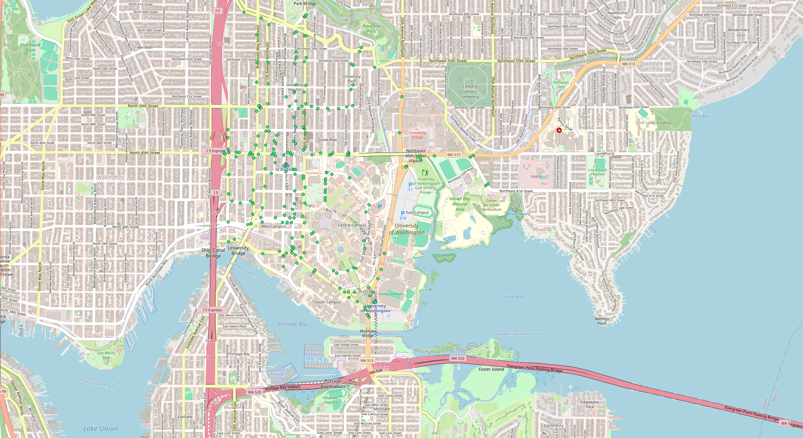
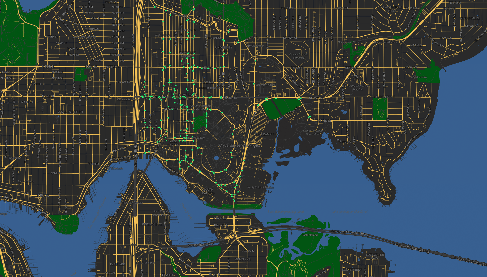
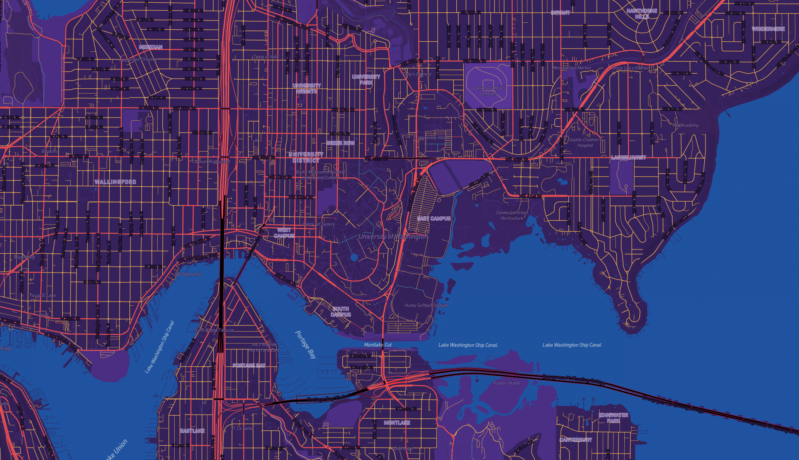

# UW bus stops tile map

# Web URL
https://yuanfw-ops.github.io/geog458-lab4/

# Screenshots
## Layer 1: base map

## later 2: data

## layer 3: base map + data

## layer 4: UW theme map

# Examined area
All layers focus on UW campus and surrounding regionn. 

# Available zoom level
12 - 15

# Tile set description
All of the tile sets are from zooming level 12-15 based on proper initial zooming level (around UW campus) with respective features selected. 