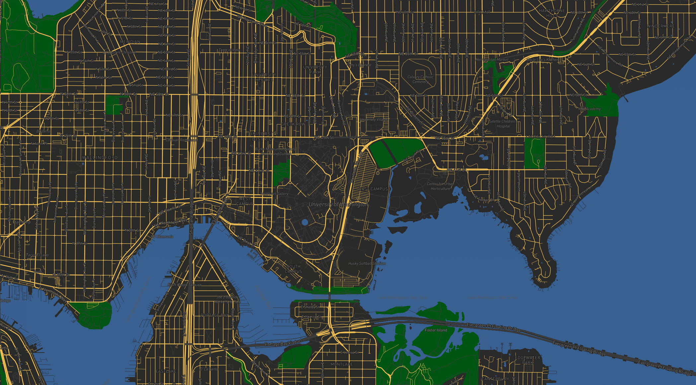

# UW bus stops tile map

# Web URL
(https://yuanfw-ops.github.io/geog458-lab4/)

# Screenshots
## Layer 1: base map

## later 2: data

## layer 3: base map + data

## layer 4: UW theme map
# Examined area
All layers focus on UW campus and surrounding regionn. 

# Available zoom level
12 - 15